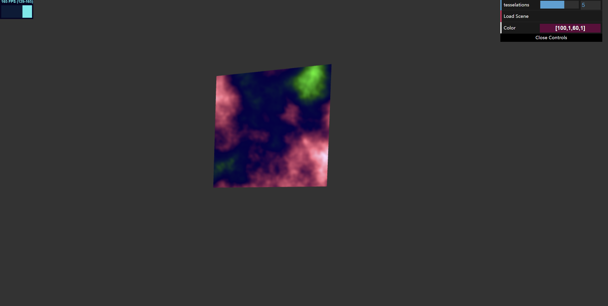

# HW 0: Intro to Javascript and WebGL

Tasks finished:
1.Draw a Cube                 
2.Add Color Control GUI using gui.addColor
3.Use Perlin noise and fbm to create custome fragment shader
4.Distort vertices with noise and sin, cos functions.

Screenshot: 
Live Site: https://angelasiruizhu.github.io/hw00-intro-base/
